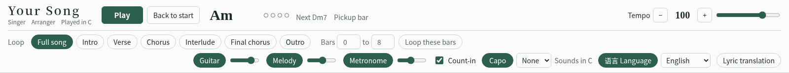

# 吉他跟弹模拟器（Agent Skill）

**把一张吉他谱图片，变成可以跟着练的网页。**
把一张“六线谱 + 简谱”的吉他谱图片交给 AI，这个技能包会带着它做出一个单文件网页：原谱显示在屏幕上，光标随节拍走，伴奏和旋律同步发声。

[English](README.md)



## 生成的页面能做什么

- 直接显示**原谱图片**，按需要自动分栏，**一个横屏放完全部内容**，不滚动（手机单栏）；光标随拍子走，当前小节标黄
- 按六线谱发出**吉他伴奏**（合成音色，不用采样）
- **页面自己读简谱**并发出旋律；拍数对不上的小节标红框，可当场改
- **调速**、**节拍器**、可选**预备拍**、**变调夹**（不夹到 5 品）
- **分段循环**或自选小节循环；点任一小节跳转
- **九种界面语言**：简体中文、繁體中文、English、日本語、한국어、Español、Français、Deutsch、Português
- **歌词译文位**：使用者自己输入或整段粘贴译文，盖在歌词行上显示；可保存、下载、载入、清除
- 跟随系统深浅色；生成后不依赖网络

## 技能交给 AI 的五条原则

1. 为了方便使用，可以重新排版
2. 尽量把全部内容排进一个版面，适应普通横屏显示器
3. 忠于使用者的内容；除排版外，未经许可不作改动，哪一部分做不了要在**动手前**说明
4. 未经使用者确认，不擅自对版权等法律事项作出认定；AI 自身有限制的，当作自身限制如实说明
5. 反复思考是否穷尽了方便人们达成目标的办法

## 原理

谱面不重画。技能需要三样东西：每个小节在图上的位置、每个小节该发什么音、怎样按节拍把两者对齐。

1. `scripts/detect.py` 在图上找出谱线、小节线和音符位置，并输出放大图供读谱
2. AI 在 `song.json` 里填和弦、伴奏的拨弦型，以及简谱行、歌词行的位置（格式见 `references/song-schema.md`）
3. `scripts/build.py` 校验数据，把图片、坐标和数据合进 `assets/template.html`，生成一个 HTML 文件
4. 页面打开时，内置的识别程序从图片上读出简谱的数字、下划线和圆点，生成旋律

## 环境要求

AI 必须**能运行 Python**（Pillow、numpy）并且**能看图**。只能聊天、不能执行代码的模型用不了。

## 安装

**Claude 网页版 / 桌面版**：从 Releases 下载 ZIP，在 *Customize → Skills* 上传（需开启代码执行）。

**Claude Code**：把技能文件夹复制到个人技能目录：

```bash
git clone https://github.com/jinjin20220405/guitar-playalong-simulator.git
cp -r guitar-playalong-simulator/guitar-playalong-simulator ~/.claude/skills/
```

**其他 AI**：把 `guitar-playalong-simulator/` 文件夹放到它能读到的位置，对它说“先读 SKILL.md 再按它做”。

## 使用

上传吉他谱图片，然后说，例如：

> 把这张吉他谱做成跟弹模拟器。

AI 会先问一两个问题，再运行脚本，最后交回一个 HTML 文件。音色和音准要对照原谱试听确认；图片分辨率低时个别音可能认错。

## 适用范围与限制

- 面向“六线谱 + 简谱”的吉他谱，纯五线谱不支持
- 页面识谱目前只在一张谱上测过：约九成小节通过拍数校验；夹在下划线和歌词之间的低音点最容易认错，需要手工校对若干小节
- 连音线会重新发音，倚音忽略

## 关于你使用的曲谱

本仓库不含任何歌曲，唯一的示例是一段四小节的公有领域旋律，用作数据格式样板。把哪张谱做成模拟器由你决定。技能要求 AI 不自行对你的材料作法律认定，并在动手前说明它不会做的事。

## 许可

MIT，见 [LICENSE](LICENSE)。
